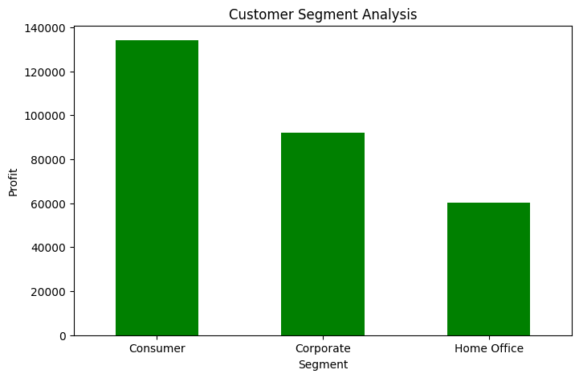

# Superstore Sales Analysis

## Dataset
- Source: Kaggle Sample Superstore Dataset (CSV)
- Contains 9,994 rows and 21 columns: order details, customers, products, sales, profit, discounts, regions, and segments.

## Goal
Analyze retail sales data to uncover trends in sales, profit, discounts, and customer behavior. Build visualizations to support business insights.

## Tools
- Python
- Pandas
- Matplotlib
- Seaborn
- Jupyter Notebook

## Analysis & Visualizations

   

   

   

   

   

   

## Insights
- High discounts reduce profitability.
- Seasonality affects sales trends.
- Focus on high-profit sub-categories and regions to maximize revenue.

## Conclusion
This analysis demonstrates how business insights can be derived from sales data using Python, Pandas, and Seaborn. The notebook provides visualizations and actionable insights for decision-making.
